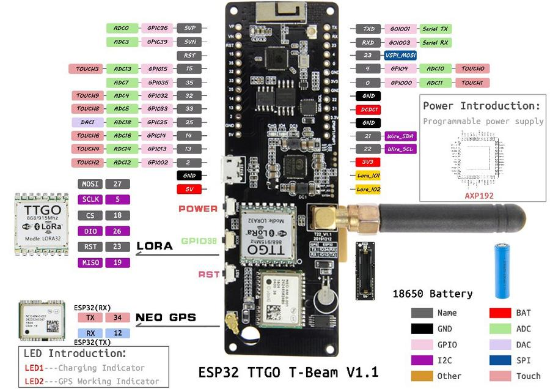

# TTN Mapper T-beam

Energy efficient mapping software for [ttnmapper](http://ttnmapper.org/) using a T-beam.

Send your GPS-Location over [TTS](https://www.thethingsnetwork.org/). The Location can be viewed on the [advanced maps](https://ttnmapper.org/advanced-maps/) when the [integration](https://docs.ttnmapper.org/integration/tts-integration-v3.html) is activated.

## Features

* deep sleep ESP32 to save energy
* geofence for location upload
* detect no movement
* sleep-mode while not in use

## Usage

LED IO4(red):
* off: device in permanent sleep or off
* gliming: device is in deep sleep waiting for the next transmission time
* on: device is active either joining or has woken up to send the next message

LED CHG(blue):

* off: everything ok
* on: battery is charging

LED GPS(red,next to the GPS-Module):
* off: GPS off or no fix
* blinking: GPS has fix

Button Power(PWR):

* short press(1 sec) to turn the device on or if already powered wake up, send the current location and go back to sleep again
* long press(2 sec/wait until IO4 LED goes off) put the device into permanent sleep mode turning off the GPS and radio while preserving LoraWAN credentials
* very long press(10 sec) completely turn off the ESP loosing all credentials

## Hardware

I'm using the TTGO-T-beam v1.1(with the axp power management chip onboard)

But the software can easily be modified to run on any ESP32-Board with a GPS and a LoRa module attached.

## Compiling

### Software

Clone this repository and open it with [Visual Studio Code(vscode)](https://code.visualstudio.com/). This code editor automaticly downloads the extension [platformio](https://platformio.org/) to compile and upload the program.

### Modification

You have to modify the [credentials.h](src/credentials.h) by inserting your own TTS-keys and the [locations.h](src/locations.h) to use or disable the geofencing option. You also have to modify the regional parameters in the lmic lib under '.pio/libdeps/esp32/MCCI LoRaWAN LMIC library/project_config/lmic_project_config.h'

### Upload

For uploading just hit the upload-button at the bottom of the vscode window
